# Reconnect 

Reconnect is a company that provides probation agent features as a service.  It currently has two platforms. 

Reconnect Community: 

- https://reconnectcommunity.com/
- https://play.google.com/store/apps/details?id=org.call2test.connectcomply
- https://apps.apple.com/us/app/reconnect-community/id1309831445

Reconnect Manager:

- https://reconnectmanager.com/
- https://play.google.com/store/apps/details?id=io.reconnect.reconnectmanager
- https://apps.apple.com/us/app/reconnect-manager/id1492161478


They also have https://reconnect.io that seems to be their main website.


Reconnect community is for people on probation, where they need to do checkups and connect to their probation agent. Reconnect Manager is the platform that probation agents use to connect with their people.

[TOC]

### Statement found on reconnect community website


## Reconnect community

Platform for people on probation

- https://reconnectcommunity.com/
- https://play.google.com/store/apps/details?id=org.call2test.connectcomply
- https://apps.apple.com/us/app/reconnect-community/id1309831445

### Website

The website is straightforward, describe what the service provides, but give little information about the data they collect about their users.

First of, as of today the privacy policy link leads to a not found page. Same thing for the Terms & Conditions.

[This page](https://reconnectcommunity.com/client-resources/) provides resources for individuals to reintegrate society 

### Data collection

https://reconnectcommunity.com/project/phone-settings/ This page provides informations about what the application collects and what data they don't.

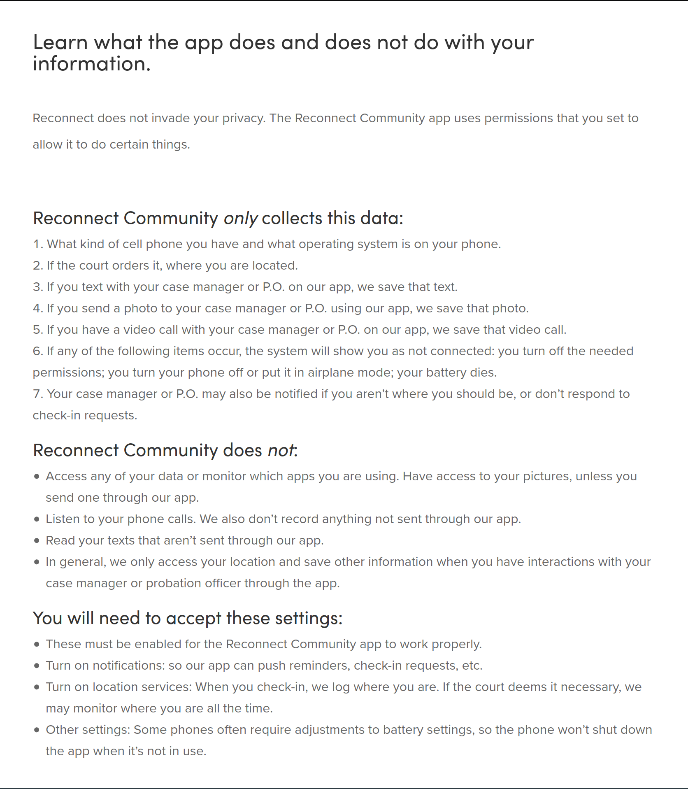

#### Android permissions

However, here's the permissions that the application requires listed on the Google Play Store

<div class="g3VIld LhXUod t89eC Up8vH J9Nfi iWO5td" jscontroller="KkXpv" jsaction="rcuQ6b:rcuQ6b;Vws5Ae:JIbuQc;DahzHe:U8CY9;vbKBWe:IrPMqd;WB41gf:iuJMzb;eAkbGb:PA60s;CCI6n:zjRS5; keydown:I481le; clickonly:cOuCgd;qUuEUd:H8nU8b;j9grLe:H8nU8b;HUObcd:H8nU8b; mousedown:H8nU8b; touchstart:H8nU8b; focus:H8nU8b; blur:H8nU8b;ktrlGc:tqg2Kb;LNlWBf:.CLIENT;touchmove:.CLIENT;HVE1Kb:.CLIENT" jsshadow="" role="dialog" tabindex="0" data-ok-button-click-text="" data-use-custom-click-handling="false" data-position="eEPege" data-cancelids="IbE0S" aria-labelledby="dwrFZd0"><div tabindex="0" aria-hidden="true" class="pw1uU" jsaction="focus:.CLIENT"></div><span jsslot="" jsname="bN97Pc" class="PbnGhe oJeWuf fb0g6 Pq2lFf" jsaction="Vws5Ae:.CLIENT"><c-wiz jsrenderer="AMnZib" jsshadow="" jsdata="deferred-c2" data-p="%.@.[&quot;org.call2test.connectcomply&quot;,7]]" data-node-index="0;0" jsmodel="hc6Ubd"><div class="vM1wDe">Showing permissions for all versions of this app</div><div class="U2Wohd TfOa3"><div class="p6U4qc">This app has access to:</div><div class="itQHhe"><div class="wOeix"><span class="SoU6Qc"><span>Device &amp; app history</span></span></div><ul class="GLaCt"><li class="BCMWSd"><span>retrieve running apps</span></li></ul></div><div class="itQHhe"><div class="wOeix"><span class="SoU6Qc"><span>Location</span></span></div><ul class="GLaCt"><li class="BCMWSd"><span>approximate location (network-based)</span></li><li class="BCMWSd"><span>precise location (GPS and network-based)</span></li></ul></div><div class="itQHhe"><div class="wOeix"><span class="SoU6Qc"><span>Phone</span></span></div><ul class="GLaCt"><li class="BCMWSd"><span>directly call phone numbers</span></li><li class="BCMWSd"><span>read phone status and identity</span></li></ul></div><div class="itQHhe"><div class="wOeix"><span class="SoU6Qc"><span>Photos/Media/Files</span></span></div><ul class="GLaCt"><li class="BCMWSd"><span>read the contents of your USB storage</span></li><li class="BCMWSd"><span>modify or delete the contents of your USB storage</span></li></ul></div><div class="itQHhe"><div class="wOeix"><span class="SoU6Qc"><span>Storage</span></span></div><ul class="GLaCt"><li class="BCMWSd"><span>read the contents of your USB storage</span></li><li class="BCMWSd"><span>modify or delete the contents of your USB storage</span></li></ul></div><div class="itQHhe"><div class="wOeix"><span class="SoU6Qc"><span>Camera</span></span></div><ul class="GLaCt"><li class="BCMWSd"><span>take pictures and videos</span></li></ul></div><div class="itQHhe"><div class="wOeix"><span class="SoU6Qc"><span>Microphone</span></span></div><ul class="GLaCt"><li class="BCMWSd"><span>record audio</span></li></ul></div><div class="itQHhe"><div class="wOeix"><span class="SoU6Qc"><span>Wi-Fi connection information</span></span></div><ul class="GLaCt"><li class="BCMWSd"><span>view Wi-Fi connections</span></li></ul></div><div class="itQHhe"><div class="wOeix"><span class="SoU6Qc"><span>Device ID &amp; call information</span></span></div><ul class="GLaCt"><li class="BCMWSd"><span>read phone status and identity</span></li></ul></div><div class="itQHhe"><div class="wOeix"><div class="T44sv m3qUef"></div><span class="SoU6Qc"><span>Other</span></span></div><ul class="GLaCt"><li class="BCMWSd"><span>receive data from Internet</span></li><li class="BCMWSd"><span>view network connections</span></li><li class="BCMWSd"><span>pair with Bluetooth devices</span></li><li class="BCMWSd"><span>access Bluetooth settings</span></li><li class="BCMWSd"><span>send sticky broadcast</span></li><li class="BCMWSd"><span>full network access</span></li><li class="BCMWSd"><span>change your audio settings</span></li><li class="BCMWSd"><span>control Near Field Communication</span></li><li class="BCMWSd"><span>run at startup</span></li><li class="BCMWSd"><span>draw over other apps</span></li><li class="BCMWSd"><span>control vibration</span></li><li class="BCMWSd"><span>prevent device from sleeping</span></li></ul></div></div><c-data id="c2" jsdata=" D7j3Re;_;$12"></c-data></c-wiz></span><div tabindex="0" aria-hidden="true" class="pw1uU" jsaction="focus:.CLIENT"></div></div>


#### IOS permissions

And here's the permissions requested by the application on IOS devices.

<div class=we-modal__content__wrapper><div class=app-privacy__modal-section><div><div class=privacy-type__icon><svg aria-hidden=true height=64 viewBox="0 0 64 64"width=64 xmlns=http://www.w3.org/2000/svg><path d="M32.09 61.568c16.185 0 29.586-13.43 29.586-29.587 0-16.186-13.43-29.587-29.616-29.587-16.157 0-29.558 13.4-29.558 29.587 0 16.156 13.43 29.587 29.587 29.587zm0-4.932c-13.692 0-24.628-10.964-24.628-24.655 0-13.692 10.907-24.656 24.598-24.656 13.691 0 24.656 10.964 24.685 24.656.03 13.69-10.965 24.655-24.656 24.655zm-.03-25.555c4.12.03 7.455-3.48 7.455-8.121 0-4.351-3.336-7.977-7.455-7.977s-7.455 3.626-7.455 7.977c0 4.64 3.336 8.092 7.455 8.121zM18.804 46.687h26.512c1.16 0 1.712-.754 1.712-1.827 0-3.162-4.786-11.4-14.968-11.4-10.181 0-14.967 8.238-14.967 11.4 0 1.073.55 1.827 1.711 1.827z"></path></svg></div><h2 class=privacy-type__heading>Data Linked to You</h2><p class=privacy-type__description>The following data, which may be collected and linked to your identity, may be used for the following purposes:<h3 class=privacy-type__purpose-heading>Analytics</h3><div class=privacy-type__grid><div class=privacy-type__grid-icon><svg aria-hidden=true height=64 viewBox="0 0 64 64"width=64 xmlns=http://www.w3.org/2000/svg class="privacy-type__glyph privacy-type__glyph--location"><path d="M7.54 33.695l22.177.088c.41 0 .615.176.615.615l.059 22.12c0 2.782 1.23 5.068 3.545 5.068 2.226 0 3.428-2.08 4.482-4.395L60.86 8.851c.557-1.142.821-2.168.821-3.017 0-1.934-1.436-3.399-3.399-3.399-.878 0-1.904.235-3.046.791L6.895 25.638C4.668 26.664 2.5 27.894 2.5 30.15s2.168 3.545 5.04 3.545z"></path></svg></div><div class=privacy-type__grid-content><h4 class=privacy-type__data-category-heading>Location</h4><ul class=privacy-type__category-items><li>Coarse Location</ul></div></div><h3 class=privacy-type__purpose-heading>Product Personalization</h3><div class=privacy-type__grid><div class=privacy-type__grid-icon><svg aria-hidden=true height=64 viewBox="0 0 64 64"width=64 xmlns=http://www.w3.org/2000/svg class="privacy-type__glyph privacy-type__glyph--identifiers"><path d="M52.367 24h-14.76C36.704 24 36 23.342 36 22.51c0-.835.705-1.51 1.606-1.51h14.761c.905 0 1.633.675 1.633 1.51 0 .832-.728 1.49-1.633 1.49m0 10h-14.76C36.704 34 36 33.35 36 32.52c0-.85.705-1.52 1.606-1.52h14.761c.905 0 1.633.67 1.633 1.52 0 .83-.728 1.48-1.633 1.48m0 9h-14.76C36.704 43 36 42.33 36 41.484c0-.83.705-1.484 1.606-1.484h14.761c.905 0 1.633.654 1.633 1.484C54 42.33 53.272 43 52.367 43m-24.04 0H12.66C10.7 43 10 42.459 10 41.401 10 38.288 14.028 34 20.493 34 26.973 34 31 38.288 31 41.401 31 42.46 30.305 43 28.328 43m-7.321-22C23.673 21 26 23.31 26 26.425 26 29.58 23.686 32 21.007 32 18.314 32 16 29.58 16 26.452 15.987 23.359 18.327 21 21.007 21m32.158-10h-42.33C5.645 11 3 13.566 3 18.645V45.33C3 50.408 5.644 53 10.835 53h42.33C58.355 53 61 50.408 61 45.329V18.645C61 13.592 58.356 11 53.165 11"></path></svg></div><div class=privacy-type__grid-content><h4 class=privacy-type__data-category-heading>Identifiers</h4><ul class=privacy-type__category-items><li>User ID</ul></div></div><h3 class=privacy-type__purpose-heading>App Functionality</h3><div class=privacy-type__grid><div class=privacy-type__grid-icon><svg aria-hidden=true height=64 viewBox="0 0 64 64"width=64 xmlns=http://www.w3.org/2000/svg class="privacy-type__glyph privacy-type__glyph--location"><path d="M7.54 33.695l22.177.088c.41 0 .615.176.615.615l.059 22.12c0 2.782 1.23 5.068 3.545 5.068 2.226 0 3.428-2.08 4.482-4.395L60.86 8.851c.557-1.142.821-2.168.821-3.017 0-1.934-1.436-3.399-3.399-3.399-.878 0-1.904.235-3.046.791L6.895 25.638C4.668 26.664 2.5 27.894 2.5 30.15s2.168 3.545 5.04 3.545z"></path></svg></div><div class=privacy-type__grid-content><h4 class=privacy-type__data-category-heading>Location</h4><ul class=privacy-type__category-items><li>Precise Location<li>Coarse Location</ul></div></div><div class=privacy-type__grid><div class=privacy-type__grid-icon><svg aria-hidden=true height=64 viewBox="0 0 64 64"width=64 xmlns=http://www.w3.org/2000/svg class="privacy-type__glyph privacy-type__glyph--contact-info"><path d="M32.09 61.568c16.185 0 29.586-13.43 29.586-29.587 0-16.186-13.43-29.587-29.616-29.587-16.157 0-29.558 13.4-29.558 29.587 0 16.156 13.43 29.587 29.587 29.587zm-.29-40.175c-2.176 0-3.917-1.74-3.917-3.945 0-2.204 1.74-3.945 3.916-3.945s3.887 1.74 3.887 3.945-1.711 3.945-3.887 3.945zm-4.961 27.093c-1.247 0-2.205-.9-2.205-2.147 0-1.16.958-2.117 2.205-2.117h3.684V30.588h-3.19c-1.22 0-2.176-.899-2.176-2.146 0-1.16.957-2.118 2.175-2.118h5.627c1.538 0 2.35 1.103 2.35 2.727v15.17h3.684c1.247 0 2.204.958 2.204 2.118 0 1.247-.957 2.147-2.204 2.147H26.839z"></path></svg></div><div class=privacy-type__grid-content><h4 class=privacy-type__data-category-heading>Contact Info</h4><ul class=privacy-type__category-items><li>Physical Address<li>Phone Number</ul></div></div><div class=privacy-type__grid><div class=privacy-type__grid-icon><svg aria-hidden=true height=64 viewBox="0 0 64 64"width=64 xmlns=http://www.w3.org/2000/svg class="privacy-type__glyph privacy-type__glyph--user-content"><path d="M10.227 24.818c0-6.378 3.38-9.713 9.803-9.713h30.333v-.563c0-4.643-2.366-6.987-7.076-6.987H9.122c-4.732 0-7.076 2.344-7.076 6.987v23.73c0 4.643 2.344 6.964 7.076 6.964h1.105V24.818zm10.14 31.28h34.188c4.687 0 7.076-2.344 7.076-6.986V25.156c0-4.62-2.389-6.964-7.076-6.964H20.368c-4.71 0-7.077 2.322-7.077 6.964v23.956c0 4.642 2.367 6.986 7.077 6.986zm8.655-19.2a5.232 5.232 0 01-5.229-5.229c0-2.862 2.344-5.228 5.229-5.228 2.862 0 5.205 2.366 5.205 5.228 0 2.885-2.343 5.228-5.205 5.228zM20.12 52.47c-2.028 0-3.2-1.15-3.2-3.2v-1.848l3.944-3.583c1.983-1.803 3.155-3.043 4.732-3.043 1.623 0 2.907 1.285 4.98 3.065l2.119 1.893 7.37-6.648c2.478-2.231 4.1-3.741 6.061-3.741 2.006 0 3.696 1.465 6.108 3.741l5.769 5.476v4.688c0 2.05-1.194 3.2-3.2 3.2H20.12z"></path></svg></div><div class=privacy-type__grid-content><h4 class=privacy-type__data-category-heading>User Content</h4><ul class=privacy-type__category-items><li>Photos or Videos<li>Audio Data</ul></div></div><div class=privacy-type__grid><div class=privacy-type__grid-icon><svg aria-hidden=true height=64 viewBox="0 0 64 64"width=64 xmlns=http://www.w3.org/2000/svg class="privacy-type__glyph privacy-type__glyph--identifiers"><path d="M52.367 24h-14.76C36.704 24 36 23.342 36 22.51c0-.835.705-1.51 1.606-1.51h14.761c.905 0 1.633.675 1.633 1.51 0 .832-.728 1.49-1.633 1.49m0 10h-14.76C36.704 34 36 33.35 36 32.52c0-.85.705-1.52 1.606-1.52h14.761c.905 0 1.633.67 1.633 1.52 0 .83-.728 1.48-1.633 1.48m0 9h-14.76C36.704 43 36 42.33 36 41.484c0-.83.705-1.484 1.606-1.484h14.761c.905 0 1.633.654 1.633 1.484C54 42.33 53.272 43 52.367 43m-24.04 0H12.66C10.7 43 10 42.459 10 41.401 10 38.288 14.028 34 20.493 34 26.973 34 31 38.288 31 41.401 31 42.46 30.305 43 28.328 43m-7.321-22C23.673 21 26 23.31 26 26.425 26 29.58 23.686 32 21.007 32 18.314 32 16 29.58 16 26.452 15.987 23.359 18.327 21 21.007 21m32.158-10h-42.33C5.645 11 3 13.566 3 18.645V45.33C3 50.408 5.644 53 10.835 53h42.33C58.355 53 61 50.408 61 45.329V18.645C61 13.592 58.356 11 53.165 11"></path></svg></div><div class=privacy-type__grid-content><h4 class=privacy-type__data-category-heading>Identifiers</h4><ul class=privacy-type__category-items><li>User ID</ul></div></div></div></div><div class=app-privacy__modal-section><div><div class=privacy-type__icon><svg aria-hidden=true height=64 viewBox="0 0 64 64"width=64 xmlns=http://www.w3.org/2000/svg><path d="M7.36 17l3.208 3.208A24.23 24.23 0 007.39 32.235c0 13.44 10.93 24.374 24.366 24.374 4.374 0 8.483-1.159 12.035-3.186L47 56.631A28.616 28.616 0 0131.756 61C15.874 61 3 48.122 3 32.235A28.637 28.637 0 017.36 17zM9.77 6.642l47.588 47.606a2.204 2.204 0 010 3.11 2.206 2.206 0 01-3.111 0L6.632 9.753c-.829-.8-.856-2.283 0-3.11.826-.828 2.253-.886 3.138 0zM32.238 3C48.123 3 61 15.878 61 31.761c0 5.597-1.599 10.82-4.364 15.239l-3.208-3.209a24.221 24.221 0 003.182-12.03c0-13.437-10.934-24.37-24.372-24.37a24.223 24.223 0 00-12.03 3.18L17 7.363A28.628 28.628 0 0132.238 3zm-7.492 31L36 45H18.373C17.44 45 17 44.418 17 43.572c0-2.224 2.5-7.11 7.746-9.572zm6.915-20C35.733 14 39 17.634 39 22.002c0 2.419-.874 4.529-2.281 5.998L26 16.923C27.343 15.145 29.376 14 31.661 14z"></path></svg></div><h2 class=privacy-type__heading>Data Not Linked to You</h2><p class=privacy-type__description>The following data, which may be collected but is not linked to your identity, may be used for the following purposes:<h3 class=privacy-type__purpose-heading>App Functionality</h3><div class=privacy-type__grid><div class=privacy-type__grid-icon><svg aria-hidden=true height=64 viewBox="0 0 64 64"width=64 xmlns=http://www.w3.org/2000/svg class="privacy-type__glyph privacy-type__glyph--usage-data"><path d="M49.925 53.844h7.098c3.287 0 4.978-1.572 4.978-4.692V14.52c0-3.12-1.69-4.717-4.978-4.717h-7.098c-3.239 0-4.93 1.596-4.93 4.717v34.632c0 3.12 1.691 4.692 4.93 4.692zm-21.412 0h7.097c3.287 0 4.955-1.572 4.955-4.692V21.475c0-3.12-1.668-4.717-4.955-4.717h-7.097c-3.264 0-4.955 1.596-4.955 4.717v27.677c0 3.12 1.691 4.692 4.955 4.692zm-21.413 0h7.074c3.287 0 4.978-1.572 4.978-4.692V28.406c0-3.12-1.691-4.716-4.978-4.716H7.1c-3.264 0-4.955 1.596-4.955 4.716v20.746c0 3.12 1.691 4.692 4.955 4.692z"></path></svg></div><div class=privacy-type__grid-content><h4 class=privacy-type__data-category-heading>Usage Data</h4><ul class=privacy-type__category-items><li>Product Interaction</ul></div></div><div class=privacy-type__grid><div class=privacy-type__grid-icon><svg aria-hidden=true height=64 viewBox="0 0 64 64"width=64 xmlns=http://www.w3.org/2000/svg class="privacy-type__glyph privacy-type__glyph--diagnostics"><path d="M29.47 61.996h5.234c1.48 0 2.56-.882 2.873-2.332l1.48-6.258c1.109-.37 2.19-.797 3.128-1.252l5.49 3.357c1.223.768 2.617.654 3.64-.37l3.67-3.64c1.024-1.025 1.166-2.504.341-3.727l-3.356-5.433c.483-.995.91-2.02 1.223-3.043l6.314-1.508c1.45-.313 2.304-1.393 2.304-2.872v-5.149c0-1.45-.853-2.531-2.304-2.844l-6.257-1.508c-.37-1.166-.825-2.218-1.223-3.1l3.356-5.518c.796-1.223.711-2.617-.341-3.64l-3.727-3.67c-1.052-.967-2.303-1.138-3.555-.427l-5.575 3.442c-.91-.483-1.962-.91-3.129-1.28l-1.479-6.343c-.313-1.45-1.393-2.332-2.873-2.332h-5.233c-1.48 0-2.56.882-2.901 2.332l-1.48 6.286c-1.109.37-2.19.797-3.157 1.309l-5.518-3.414c-1.251-.71-2.531-.568-3.584.427l-3.697 3.67c-1.053 1.023-1.166 2.417-.342 3.64l3.328 5.518c-.37.882-.825 1.934-1.194 3.1l-6.258 1.508c-1.45.313-2.304 1.394-2.304 2.844v5.149c0 1.479.853 2.56 2.304 2.872l6.315 1.508c.312 1.024.739 2.048 1.194 3.043L8.85 47.774c-.853 1.223-.682 2.702.342 3.726l3.64 3.641c1.024 1.024 2.446 1.138 3.67.37l5.46-3.357c.968.455 2.02.882 3.13 1.252l1.479 6.258c.34 1.45 1.422 2.332 2.9 2.332zm2.618-19.683c-5.518 0-10.04-4.551-10.04-10.07 0-5.489 4.522-10.011 10.04-10.011 5.518 0 10.04 4.522 10.04 10.012 0 5.518-4.522 10.069-10.04 10.069z"></path></svg></div><div class=privacy-type__grid-content><h4 class=privacy-type__data-category-heading>Diagnostics</h4><ul class=privacy-type__category-items><li>Crash Data<li>Performance Data</ul></div></div></div></div></div>

### IOS Application

Let's take a look at the ios application.

#### App Store


##### Reviews

First off, we can see that the reviews are mostly negative

<table>
<tr>
<td></td>
<td></td>
<td></td>
</tr>
<tr>
<td></td>
<td></td>
</tr>
</table>
##### Information page

Here's the information page:


The privacy policy link in this page leads to this page: https://reconnect.io/privacy-policy/

#### First Launch of the application

When we first launch the application, we are invited to allow notifications and enable critical alerts

<table>
<tr>
<td></td>
<td></td>
</tr>
</table>

After that we face a login screen and we don't have login informations so we cannot continue further.

### Android application

Let's take a look at the android application.

#### Play store

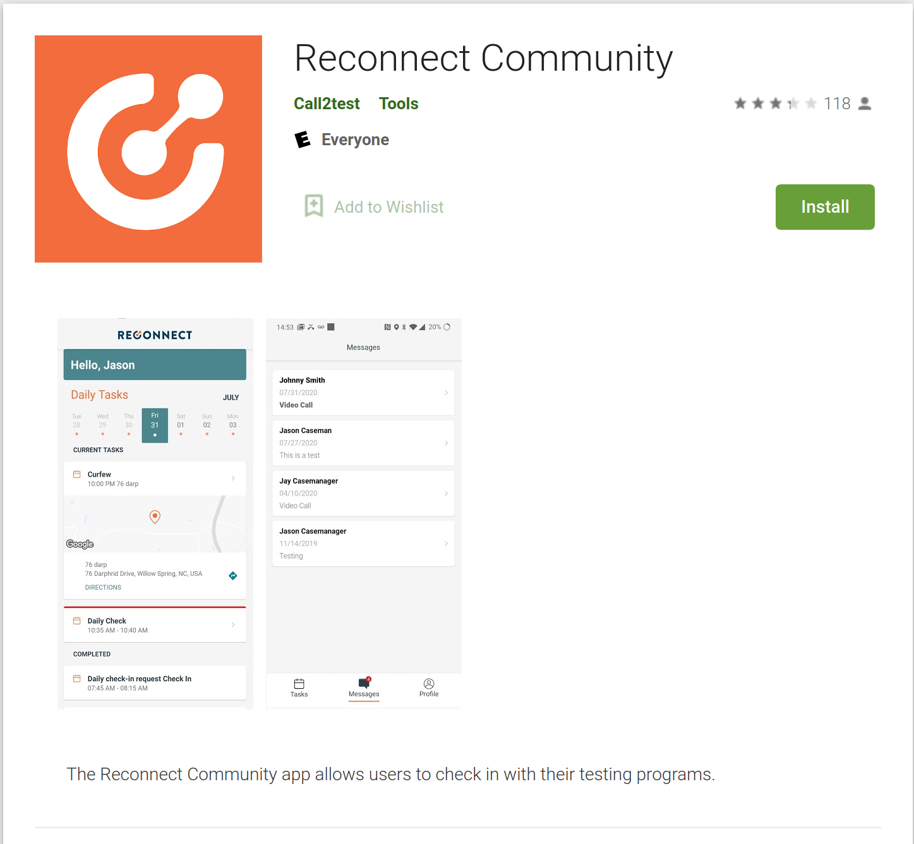

We still have similar negative reviews for the android version.

##### Reviews

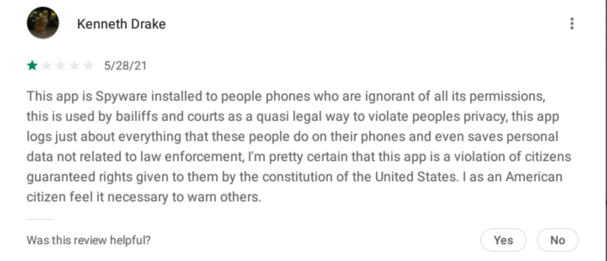

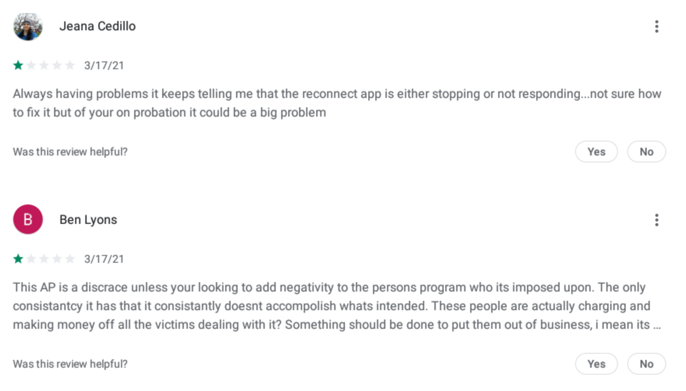

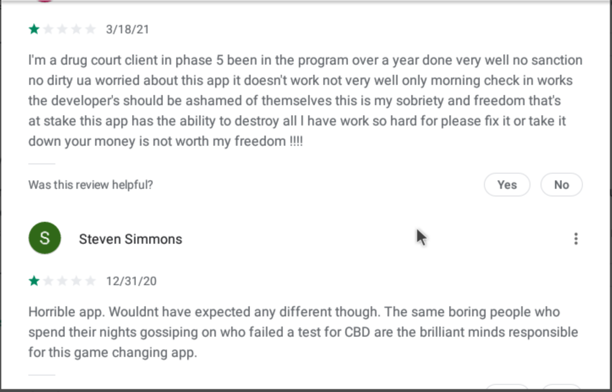

##### Information page

And here's the information page

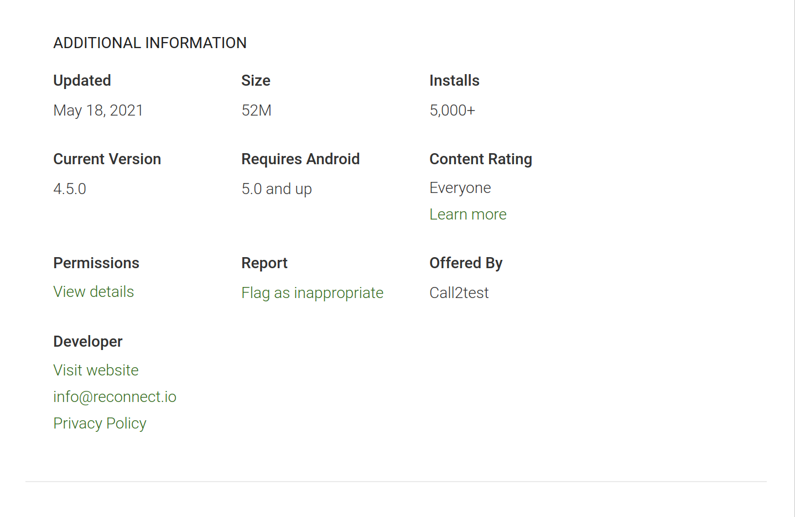

#### First Launch of the application

When we first launch the application, we are presented a login screen similar to the login screen on the ios version of the application

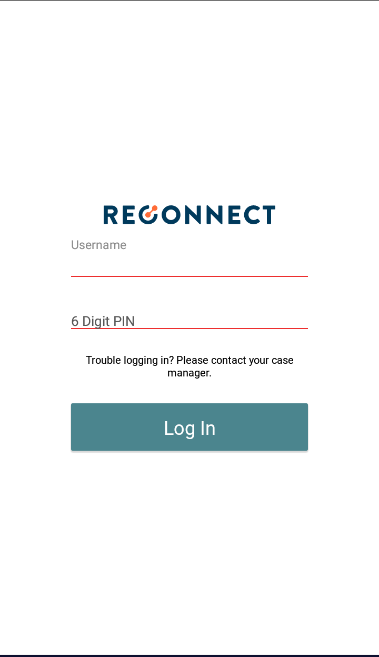

And like the ios version, we don't have login informations so we cannot continue further.

### API Calls

Although we cannot dig further in the application, we can still analyze some API calls made by the application on launch.

#### Login

The most interesting call as far as we can dig is the login api call, which is pretty basic and straight forward

##### Request

**IOS:**

```http
POST https://worker.reconnectmanager.com/app_v1/client/get_with_username_v2 HTTP/1.1
Host: worker.reconnectmanager.com
Accept: application/json
Content-Type: application/json
User-Agent: connectcomplymobile/170	CFNetwork/978.0.7 Darwin/18.7.0
```

**Android:**

```http
POST https://worker.reconnectmanager.com/app_v1/client/get_with_username_v2 HTTP/1.1
Host: worker.reconnectmanager.com
Accept: application/json
Content-Type: application/json
User-Agent: okhttp/3.14.1
```

**Body:**

```json
{
    "check_in_pin": "123456",
    "username": "test"
}
```

##### Response

This is the response you get when for an invalid login

```json
{
    "error": {
        "client": "<p>Unable to find that client</p>"
    },
    "message": "",
    "status": "error"
}
```

##### But wait

According to some reviews, the login credentials are not really secure.

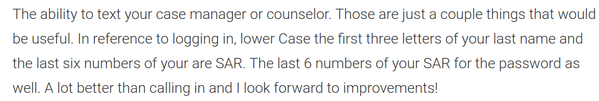

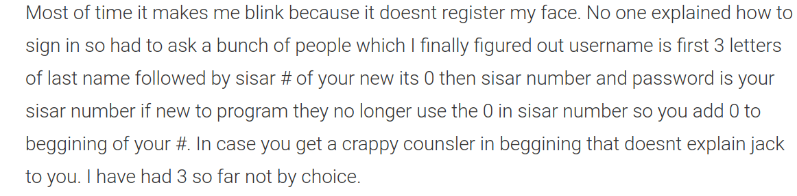

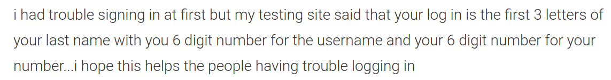

The password or PIN is always 6 characters. The login or Username is 3 + 6 = 9 characters. Not only they are short, they aren't even random. If you have a SAR (Service Access to Recovery) number, you only need to guess 3 characters (26³ = 17 576 combinations). 


## Reconnect Manager

Platform for probation agents

- https://reconnectmanager.com
- https://play.google.com/store/apps/details?id=io.reconnect.reconnectmanager
- https://apps.apple.com/us/app/reconnect-manager/id1492161478

### Website

The website is pretty straightforward since it's only a login screen.


### Data collection

#### Android permissions

However, here's the permissions that the application requires listed on the Google Play Store

<div class="g3VIld LhXUod t89eC Up8vH J9Nfi iWO5td" jscontroller="KkXpv" jsaction="rcuQ6b:rcuQ6b;Vws5Ae:JIbuQc;DahzHe:U8CY9;vbKBWe:IrPMqd;WB41gf:iuJMzb;eAkbGb:PA60s;CCI6n:zjRS5; keydown:I481le; clickonly:cOuCgd;qUuEUd:H8nU8b;j9grLe:H8nU8b;HUObcd:H8nU8b; mousedown:H8nU8b; touchstart:H8nU8b; focus:H8nU8b; blur:H8nU8b;ktrlGc:tqg2Kb;LNlWBf:.CLIENT;touchmove:.CLIENT;HVE1Kb:.CLIENT" jsshadow="" role="dialog" tabindex="0" data-ok-button-click-text="" data-use-custom-click-handling="false" data-position="eEPege" data-cancelids="IbE0S" aria-labelledby="dwrFZd1"><div tabindex="0" aria-hidden="true" class="pw1uU" jsaction="focus:.CLIENT"></div><span jsslot="" jsname="bN97Pc" class="PbnGhe oJeWuf fb0g6 Pq2lFf" jsaction="Vws5Ae:.CLIENT"><c-wiz jsrenderer="AMnZib" jsshadow="" jsdata="deferred-c6" data-p="%.@.[&quot;io.reconnect.reconnectmanager&quot;,7]]" data-node-index="0;0" jsmodel="hc6Ubd"><div class="vM1wDe">Showing permissions for all versions of this app</div><div class="U2Wohd TfOa3"><div class="p6U4qc">This app has access to:</div><div class="itQHhe"><div class="wOeix"><span class="SoU6Qc"><span>Phone</span></span></div><ul class="GLaCt"><li class="BCMWSd"><span>read phone status and identity</span></li></ul></div><div class="itQHhe"><div class="wOeix"><span class="SoU6Qc"><span>Photos/Media/Files</span></span></div><ul class="GLaCt"><li class="BCMWSd"><span>read the contents of your USB storage</span></li><li class="BCMWSd"><span>modify or delete the contents of your USB storage</span></li></ul></div><div class="itQHhe"><div class="wOeix"><span class="SoU6Qc"><span>Storage</span></span></div><ul class="GLaCt"><li class="BCMWSd"><span>read the contents of your USB storage</span></li><li class="BCMWSd"><span>modify or delete the contents of your USB storage</span></li></ul></div><div class="itQHhe"><div class="wOeix"><span class="SoU6Qc"><span>Camera</span></span></div><ul class="GLaCt"><li class="BCMWSd"><span>take pictures and videos</span></li></ul></div><div class="itQHhe"><div class="wOeix"><span class="SoU6Qc"><span>Microphone</span></span></div><ul class="GLaCt"><li class="BCMWSd"><span>record audio</span></li></ul></div><div class="itQHhe"><div class="wOeix"><span class="SoU6Qc"><span>Wi-Fi connection information</span></span></div><ul class="GLaCt"><li class="BCMWSd"><span>view Wi-Fi connections</span></li></ul></div><div class="itQHhe"><div class="wOeix"><span class="SoU6Qc"><span>Device ID &amp; call information</span></span></div><ul class="GLaCt"><li class="BCMWSd"><span>read phone status and identity</span></li></ul></div><div class="itQHhe"><div class="wOeix"><div class="T44sv m3qUef"></div><span class="SoU6Qc"><span>Other</span></span></div><ul class="GLaCt"><li class="BCMWSd"><span>receive data from Internet</span></li><li class="BCMWSd"><span>view network connections</span></li><li class="BCMWSd"><span>pair with Bluetooth devices</span></li><li class="BCMWSd"><span>send sticky broadcast</span></li><li class="BCMWSd"><span>full network access</span></li><li class="BCMWSd"><span>change your audio settings</span></li><li class="BCMWSd"><span>run at startup</span></li><li class="BCMWSd"><span>control vibration</span></li><li class="BCMWSd"><span>prevent device from sleeping</span></li></ul></div></div><c-data id="c6" jsdata=" D7j3Re;_;$27"></c-data></c-wiz></span><div tabindex="0" aria-hidden="true" class="pw1uU" jsaction="focus:.CLIENT"></div></div>


#### IOS permissions

And here's the permissions requested by the application on IOS devices.

<div class=app-privacy__modal-section><div><div class=privacy-type__icon><svg aria-hidden=true height=64 viewBox="0 0 64 64"width=64 xmlns=http://www.w3.org/2000/svg><path d="M32.09 61.568c16.185 0 29.586-13.43 29.586-29.587 0-16.186-13.43-29.587-29.616-29.587-16.157 0-29.558 13.4-29.558 29.587 0 16.156 13.43 29.587 29.587 29.587zm0-4.932c-13.692 0-24.628-10.964-24.628-24.655 0-13.692 10.907-24.656 24.598-24.656 13.691 0 24.656 10.964 24.685 24.656.03 13.69-10.965 24.655-24.656 24.655zm-.03-25.555c4.12.03 7.455-3.48 7.455-8.121 0-4.351-3.336-7.977-7.455-7.977s-7.455 3.626-7.455 7.977c0 4.64 3.336 8.092 7.455 8.121zM18.804 46.687h26.512c1.16 0 1.712-.754 1.712-1.827 0-3.162-4.786-11.4-14.968-11.4-10.181 0-14.967 8.238-14.967 11.4 0 1.073.55 1.827 1.711 1.827z"></path></svg></div><h2 class=privacy-type__heading>Data Linked to You</h2><p class=privacy-type__description>The following data, which may be collected and linked to your identity, may be used for the following purposes:<h3 class=privacy-type__purpose-heading>Other Purposes</h3><div class=privacy-type__grid><div class=privacy-type__grid-icon><svg aria-hidden=true height=64 viewBox="0 0 64 64"width=64 xmlns=http://www.w3.org/2000/svg class="privacy-type__glyph privacy-type__glyph--identifiers"><path d="M52.367 24h-14.76C36.704 24 36 23.342 36 22.51c0-.835.705-1.51 1.606-1.51h14.761c.905 0 1.633.675 1.633 1.51 0 .832-.728 1.49-1.633 1.49m0 10h-14.76C36.704 34 36 33.35 36 32.52c0-.85.705-1.52 1.606-1.52h14.761c.905 0 1.633.67 1.633 1.52 0 .83-.728 1.48-1.633 1.48m0 9h-14.76C36.704 43 36 42.33 36 41.484c0-.83.705-1.484 1.606-1.484h14.761c.905 0 1.633.654 1.633 1.484C54 42.33 53.272 43 52.367 43m-24.04 0H12.66C10.7 43 10 42.459 10 41.401 10 38.288 14.028 34 20.493 34 26.973 34 31 38.288 31 41.401 31 42.46 30.305 43 28.328 43m-7.321-22C23.673 21 26 23.31 26 26.425 26 29.58 23.686 32 21.007 32 18.314 32 16 29.58 16 26.452 15.987 23.359 18.327 21 21.007 21m32.158-10h-42.33C5.645 11 3 13.566 3 18.645V45.33C3 50.408 5.644 53 10.835 53h42.33C58.355 53 61 50.408 61 45.329V18.645C61 13.592 58.356 11 53.165 11"></path></svg></div><div class=privacy-type__grid-content><h4 class=privacy-type__data-category-heading>Identifiers</h4><ul class=privacy-type__category-items><li>Device ID</ul></div></div></div></div>

### IOS Application

Let's take a look at the ios application.

#### App Store


##### Reviews

This application doesn't have enough reviews to be displayed
##### Information page

Here's the information page:


The privacy policy link in this page leads to this page: https://reconnect.io/privacy-policy/


#### First Launch of the application

When we first launch the application, we face a login screen and we don't have login informations so we cannot continue further.


### Android application

Let's take a look at the android application.

#### Play store

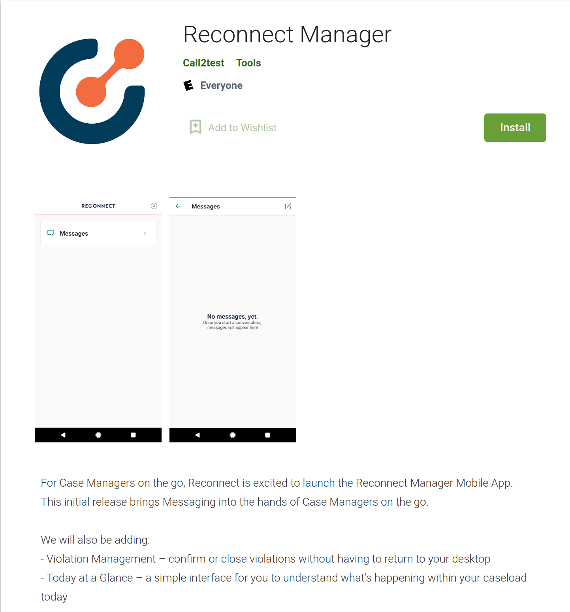

We still have similar negative reviews for the android version.

##### Reviews

This application doesn't currently have reviews.
##### Information page

And here's the information page

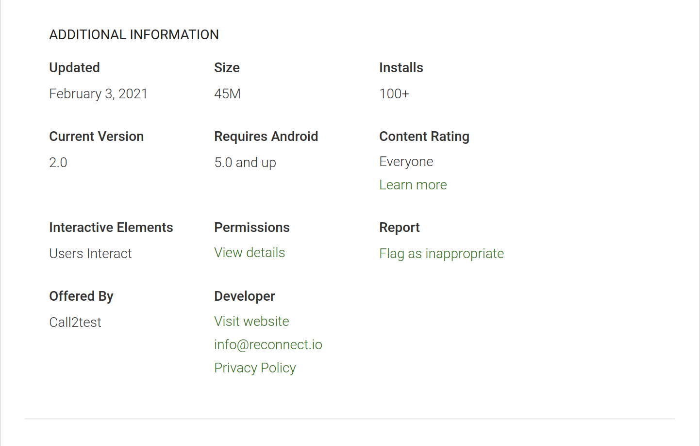

#### First Launch of the application

When we first launch the application, we are presented a login screen similar to the login screen on the ios version of the application

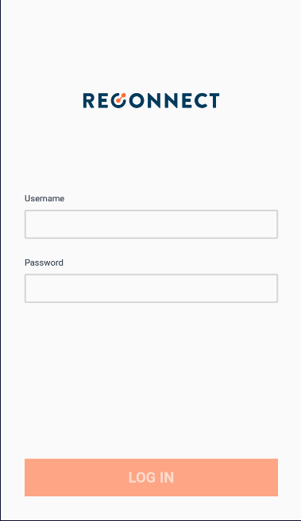

And like the ios version, we don't have login informations so we cannot continue further.

### API Calls

Although we cannot dig further in the application, we can still analyze some API calls made by the application on launch.

#### Login

The most interesting call as far as we can dig is the login api call, which is pretty basic and straight forward. It differs from the API login call of Reconnect Community

##### Request

**IOS:**

```http
POST https://call2test.auth0.com/oauth/token HTTP/2.0
Accept: application/json
Content-Type: application/json
User-Agent: Reconnect%20Manager/23 CFNetwork/978.0.7 Darwin/18.7.0
auth0-client: eyJuYW1lIjoicmVhY3QtbmF0aXZlLWF1dGgwIiwidmVyc2lvbiI6IjIuNy4wIn0=

```

**Android:**

```http
POST https://worker.reconnectmanager.com/app_v1/client/get_with_username_v2 HTTP/1.1
Accept: application/json
Content-Type: application/json
User-Agent: okhttp/3.14.3
```

**Body:**

The client_id seems to be associated with the application since it always stay the same.

```json
{
    "client_id": "juyi7clnLg6KqI8JqLaMpxv4pE4W04ej",
    "grant_type": "http://auth0.com/oauth/grant-type/password-realm",
    "password": "pass",
    "realm": "Username-Password-Authentication",
    "username": "user "
}
```

##### Response

This is the response you get when for an invalid login

**Header:**

```http
HTTP/1.1 403 Forbidden
X-Auth0-RequestId: ff7XXXX7fXXXX5c1XXX3
X-Content-Type-Options: nosniff
X-RateLimit-Limit: 1000000
X-RateLimit-Remaining: 999999
X-RateLimit-Reset: 1622398432
Server: cloudflare
```

**Body**:

```json
{
    "error": "invalid_grant",
    "error_description": "Wrong email or password."
}
```

The login credentials seems more secure on this platform and the endpoint is protected and rate-limited by Cloudflare. 


## Conclusion

In the end, we can see that although on the reconnect community page, they say that they don't collect a lot of data, but the privacy policy is not present and when you check the privacy policy on https://reconnect.io, which is the one used for the applications, they clearly state that they collect data. This is confirmed by the permissions required by those applications. 


### What's left to do

We cannot dig more further into those applications without a valid login. We can reverse engineer them and see what happens in the background. Although this audit didn't reveal a lot of informations, we still found that there is clearly a security flaw in the reconnect community login due to the nature of the credentials and that there doesn't seem to have a lot of protections.
